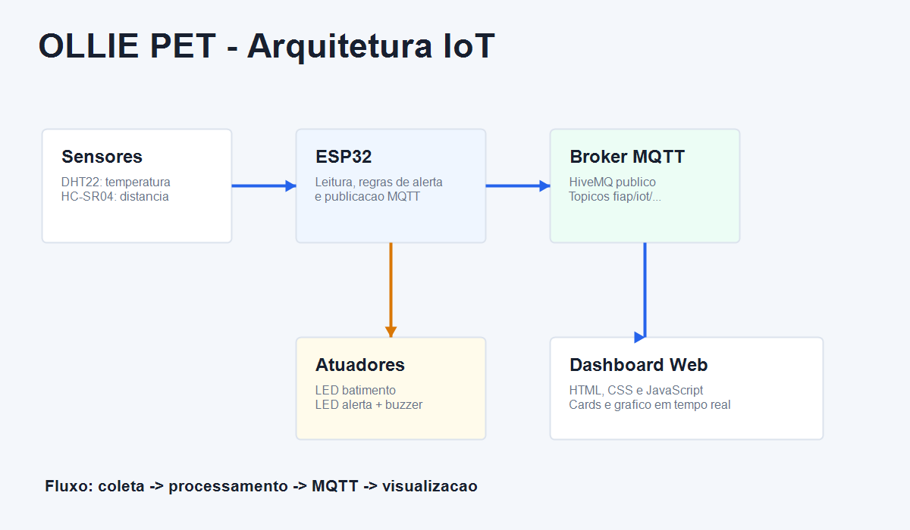
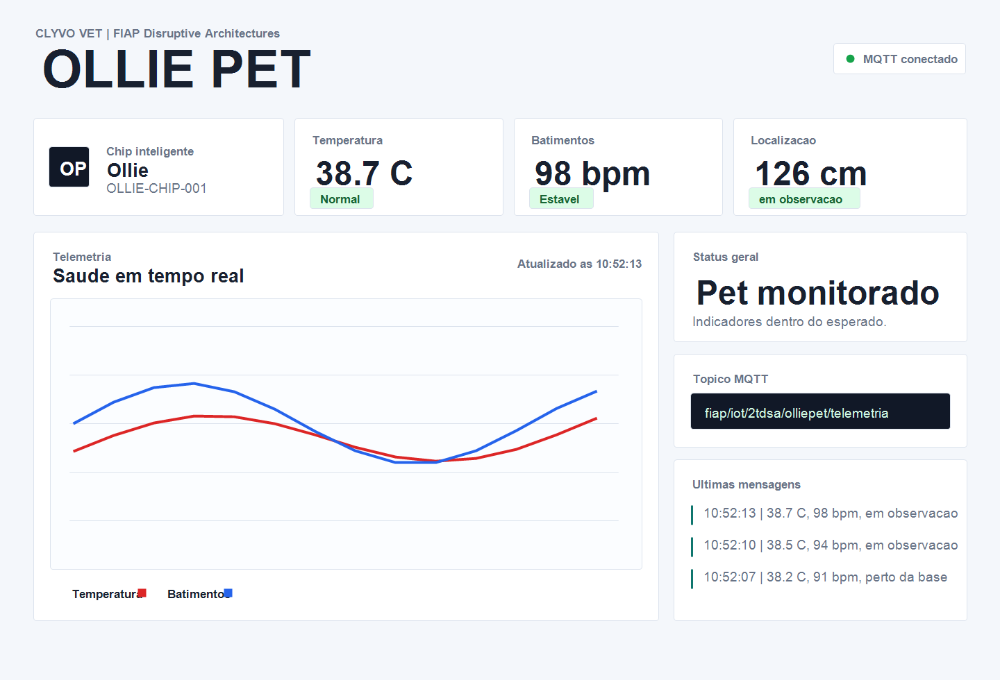

# OLLIE PET - Chip inteligente para pets

Projeto acadêmico desenvolvido para a disciplina **Disruptive Architectures: IA e IoT - FIAP**, inspirado na abordagem dos laboratórios oficiais da disciplina: prototipação simples, componentes acessíveis, ESP32, Wokwi, comunicação MQTT e visualização de dados em dashboard.

## Informações do projeto

**Nome:** OLLIE PET  
**Desafio:** Continuidade do cuidado e engajamento na jornada de saúde do pet  
**Contexto:** CLYVO VET - Infraestrutura do futuro da medicina veterinária digital  
**Tipo:** Prova de conceito IoT simulada  
**Plataforma:** ESP32 no Wokwi

## Problema

Tutoriais e clínicas veterinárias dependem de informações pontuais sobre o estado do pet. Entre uma consulta e outra, sinais como temperatura elevada, comportamento fora da rotina e possível afastamento do animal podem passar despercebidos.

O desafio é demonstrar como uma solução IoT simples poderia apoiar a continuidade do cuidado, enviando dados simulados de saúde e localização para um painel em tempo real.

## Objetivo

Criar um protótipo hipotético de chip inteligente para pets capaz de:

- Monitorar temperatura corporal simulada.
- Simular batimentos cardíacos.
- Simular localização por distância.
- Acionar alertas locais por LED e buzzer.
- Publicar telemetria via MQTT.
- Exibir dados em dashboard web responsivo.

## Solução proposta

O **OLLIE PET** usa um ESP32 no Wokwi como se fosse o chip do pet. Ele coleta dados de sensores simples, interpreta regras básicas de alerta e publica os dados em um broker MQTT público. O dashboard web recebe essas mensagens e atualiza os indicadores em tempo real.

A proposta não utiliza sensores médicos reais. O foco é demonstrar corretamente os conceitos de IoT: sensor, atuador, conectividade, protocolo, publicação de dados, assinatura de tópicos e visualização.

## Tecnologias utilizadas

| Tecnologia | Uso no projeto |
|---|---|
| ESP32 | Microcontrolador principal |
| Wokwi | Simulação do circuito |
| Arduino/C++ | Código embarcado |
| WiFi | Conexão do ESP32 simulado |
| MQTT | Comunicação entre ESP32 e dashboard |
| HiveMQ público | Broker MQTT |
| HTML | Estrutura do dashboard |
| CSS | Visual moderno e responsivo |
| JavaScript | Recebimento MQTT e atualização da interface |

## Componentes do Wokwi

| Componente | Função |
|---|---|
| ESP32 DevKit | Controlador IoT |
| DHT22 | Simula leitura de temperatura do pet |
| HC-SR04 | Simula distância/localização do pet em relação à base |
| LED vermelho | Simula batimentos cardíacos |
| LED amarelo | Indica alerta |
| Buzzer | Alerta sonoro em condição crítica |
| Resistores | Proteção dos LEDs |

## Arquitetura do sistema



Fluxo principal:

1. O ESP32 conecta ao WiFi do Wokwi.
2. O DHT22 fornece a temperatura simulada.
3. O HC-SR04 fornece a distância simulada.
4. O LED vermelho pisca simulando batimentos.
5. O ESP32 classifica o status do pet.
6. O ESP32 publica um JSON no broker MQTT.
7. O dashboard assina o tópico e atualiza os cards.

## MQTT

O projeto usa o modelo **publish/subscribe**. O ESP32 publica mensagens e o dashboard assina o tópico. Assim, o dispositivo e a interface ficam desacoplados.

**Broker:** `broker.hivemq.com`  
**Porta ESP32:** `1883`  
**WebSocket dashboard:** `wss://broker.hivemq.com:8884/mqtt`

### Tópicos utilizados

| Tópico | Conteúdo |
|---|---|
| `fiap/iot/2tdsa/olliepet/status` | Status online do dispositivo |
| `fiap/iot/2tdsa/olliepet/telemetria` | JSON completo do pet |
| `fiap/iot/2tdsa/olliepet/sensor/temperatura` | Temperatura isolada |
| `fiap/iot/2tdsa/olliepet/sensor/batimentos` | Batimentos simulados |
| `fiap/iot/2tdsa/olliepet/sensor/localizacao` | Distância simulada |
| `fiap/iot/2tdsa/olliepet/alerta` | Status `normal` ou `alerta` |

### Exemplo de payload

```json
{
  "device": "OLLIE-CHIP-001",
  "pet": "Ollie",
  "temperatura": 38.6,
  "batimentos": 96,
  "distancia_cm": 120,
  "localizacao": "em observacao",
  "status": "normal",
  "millis": 15300
}
```

## Regras de alerta

| Regra | Resultado |
|---|---|
| Temperatura maior ou igual a `39.2 C` | Alerta |
| Distância maior que `180 cm` | Alerta de localização |
| Batimentos simulados acima de `115 bpm` | Atenção |
| Status em alerta | LED amarelo aceso e buzzer ativo |

## Estrutura de pastas

```text
ollie-pet
├── README.md
├── wokwi
│   ├── diagram.json
│   ├── libraries.txt
│   ├── sketch.ino
│   └── wokwi.toml
├── dashboard
│   ├── index.html
│   ├── script.js
│   └── style.css
├── docs
│   ├── arquitetura.png
│   └── dashboard-preview.png
└── video
    └── roteiro-pitch.md
```

## Como executar no Wokwi

1. Acesse o Wokwi.
2. Crie um novo projeto com ESP32.
3. Copie o conteúdo de `wokwi/sketch.ino` para o código Arduino.
4. Copie o conteúdo de `wokwi/diagram.json` para o diagrama.
5. Garanta que as bibliotecas de `wokwi/libraries.txt` estejam disponíveis.
6. Inicie a simulação.
7. Abra o Monitor Serial para acompanhar a conexão WiFi, MQTT e os payloads publicados.

## Como executar o dashboard

1. Abra o arquivo `dashboard/index.html` no navegador.
2. Aguarde a conexão com o broker MQTT.
3. Inicie a simulação do ESP32 no Wokwi.
4. Os cards de temperatura, batimentos, localização e status serão atualizados em tempo real.

Prévia visual:



## Como demonstrar

Durante a simulação, altere os valores dos sensores no Wokwi:

- Aumente a temperatura do DHT22 para `39.2 C` ou mais para gerar alerta.
- Aumente a distância do HC-SR04 acima de `180 cm` para simular pet fora da zona segura.
- Observe o LED amarelo e o buzzer no circuito.
- Observe os cards do dashboard mudando automaticamente.

## Relação com a disciplina

O projeto segue a linha didática apresentada no material oficial de Disruptive Architectures:

- Uso de ESP32 como controlador IoT.
- Uso de sensores e atuadores simples.
- Organização por laboratórios e entrega prática.
- Comunicação em rede.
- Publicação de dados por MQTT.
- Visualização em dashboard.
- Código comentado e compreensível para estudantes.

## Possíveis melhorias futuras

- Adicionar histórico em banco de dados.
- Criar identificação de múltiplos pets.
- Enviar notificações para tutores.
- Integrar com prontuário veterinário digital.
- Usar sensor real de frequência cardíaca em uma versão física.
- Criar aplicativo mobile para acompanhamento.
- Adicionar autenticação nos tópicos MQTT.

## Observação

Este projeto é uma prova de conceito acadêmica. Os dados de saúde são simulados e não devem ser usados para diagnóstico veterinário real.
